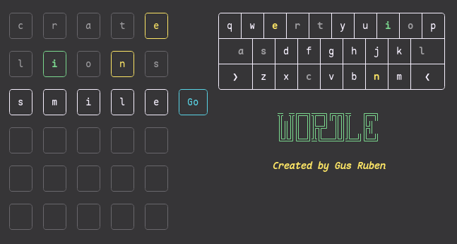

# Wordle

This is an old school project I made for a terminal clone of Wordle.

I originally wrote this using VSCode's Java extension, which means the project structure is a little strange. The easiest way to run it is through that same extension, though it should also be possible to manually set it up.

I used `JLine`, a terminal library for java, to change some terminal settings (such as disabling keyboard output / enabling 'raw' mode). At the moment, I've just included the compiled jar for `3.2.1` in the `lib` folder.

## Helper Python script

I added a keyboard display to show what letters you've already guessed. To set the colors of those keys, I needed the X and Y-positions of every key (character-wise, from the top left of the keyboard). `key.py` is a helper script to find those. `keyboard.txt` is the original 'art' for the keyboard, there are some leftover old styles I was trying out. 
